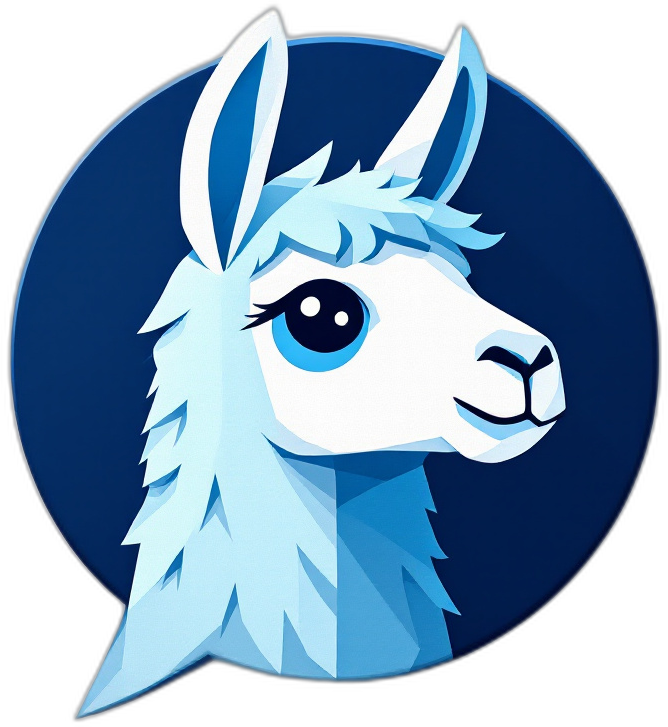

#  navAssist: Your AI-Powered Web Navigation Assistant

## 🌟 Features

- 💬 Chat with various Ollama models right in your browser
- 🔄 Seamlessly switch between different AI models
- 📊 Summarize web page content with a single click
- 📱 Responsive design with draggable and resizable chat window
- 🔌 Dynamic connection status indicator for Ollama
- 📥 Easy model management with one-click downloads for suggested models

## Latest Release

### Version 1.0.3

- Added dynamic connection status indicator for Ollama
- Implemented one-click downloads for suggested models (llama3.2, qwen2.5, qwen2.5:3b)
- Improved UI with centered title and icon
- Enhanced error handling and user feedback during model downloads
- Removed buttons for already downloaded models
- Updated to use the latest Ollama API endpoints

## 🛠️ Installation

1. Go to the [Releases](https://github.com/eponce92/navAssist/releases) page of this repository.
2. Download the `navAssist-v1.0.3.zip` file from the latest release.
3. Unzip the downloaded file.
4. Open Chrome and go to `chrome://extensions/`.
5. Enable "Developer mode" in the top right corner.
6. Click "Load unpacked" and select the unzipped folder.

The navAssist extension should now be installed and ready to use!

## 📋 Prerequisites

- Ollama must be installed and running on your local machine. You can download the latest version for macOS, Linux, or Windows from [Ollama's official website](https://ollama.com).
- Ensure the Ollama API is accessible at `http://localhost:11434`.

## 🚀 Getting Started

1. Set the `OLLAMA_ORIGINS` environment variable to allow connections from Chrome extensions:

   - On Windows:
     - Open Command Prompt or PowerShell as administrator
     - Run the following command:
       ```
       setx OLLAMA_ORIGINS "chrome-extension://*"
       ```
     - Restart your computer for the changes to take effect
   - On macOS/Linux:
     - Add the following line to your shell configuration file (e.g., `~/.bashrc`, `~/.zshrc`):
       ```
       export OLLAMA_ORIGINS="chrome-extension://*"
       ```
     - Restart your terminal or run `source ~/.bashrc` (or the appropriate config file)

2. Start Ollama:

   - Option 1 (Recommended): Simply open the Ollama application you installed.
   - Option 2 (Advanced): If you prefer using the command line, you can start the Ollama server by running:
     ```
     ollama serve
     ```

3. Click the navAssist icon in your Chrome toolbar to open the popup.
4. The extension will automatically check the connection to Ollama and display the status.
5. If connected, you'll see a list of available models. If not, ensure Ollama is running and accessible.
6. You can download suggested models (llama3.2, qwen2.5, qwen2.5:3b) directly from the popup if they're not already installed.
7. Select your preferred AI model from the dropdown menu.
8. Toggle the switch to enable navAssist.
9. Start chatting with your AI assistant on any web page!

## 💡 Usage Tips

- Use the summarize button to quickly summarize page content.
- Drag the chat window to reposition it on the page.
- Resize the chat window using the bottom-right corner handle.
- If you don't see a model you want, you can download it using the Ollama CLI and it will appear in the extension automatically.

## 🛠️ Technologies Used

- HTML5, CSS3, and JavaScript
- Chrome Extension APIs
- Ollama API for AI model integration

## 🤝 Contributing

Contributions, issues, and feature requests are welcome! Feel free to check the [issues page](https://github.com/eponce92/navAssist/issues).

## 📜 License

This project is [MIT](https://choosealicense.com/licenses/mit/) licensed.

## 🙏 Acknowledgements

- [Ollama](https://ollama.com) for providing the AI models and API

---

Made with ❤️ by [eponce92](https://github.com/eponce92)
